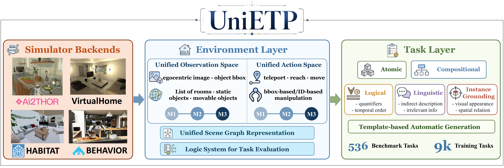

# UniETP

### Unifying Environments for Generalizable Embodied Task Planning

> We are actively working on releasing the data and code. Please stay tuned for updates!

  

## Overview

UniETP is a unified benchmark for developing and evaluating generalizable embodied task planning agents. It integrates four commonly used simulators - **AI2-THOR, VirtualHome, Habitat, and BEHAVIOR** - behind a consistent environment interface, observation space, action space, scene graph representation, and evaluation protocol.

On top of this environment layer, UniETP provides an automatic task generation pipeline that constructs diverse, grounded tasks with different levels of difficulty. The benchmark evaluates agents across atomic, compositional, logical, linguistic, and instance-grounding capabilities.

## Highlights

- **Four simulators, one interface.** Agents interact with heterogeneous simulator backends through standardized observations and actions.
- **Adjustable evaluation difficulty.** Three modes (M1/M2/M3) vary scene priors, action granularity, and grounding requirements.
- **Rich task coverage.** 138 task templates cover object states, spatial relations, temporal constraints, quantification, counting, and compositional goals.
- **Automatic task generation.** Task templates are instantiated, grounded in scenes, validated by scripted expert policies, and verbalized as natural-language instructions.
- **Fine-grained diagnosis.** Capability-oriented splits expose bottlenecks in long-horizon planning, exploration, and instance-level visual grounding.

## Citation

If you find this project useful, please cite our paper. 

## Acknowledgements

UniETP builds on the ecosystems of [AI2-THOR](https://github.com/allenai/ai2thor), [VirtualHome](https://github.com/xavierpuigf/virtualhome), [Habitat](https://github.com/facebookresearch/habitat-sim), and [BEHAVIOR-1K](https://github.com/StanfordVL/BEHAVIOR-1K). We sincerely thank their authors and maintainers for advancing embodied AI research.

